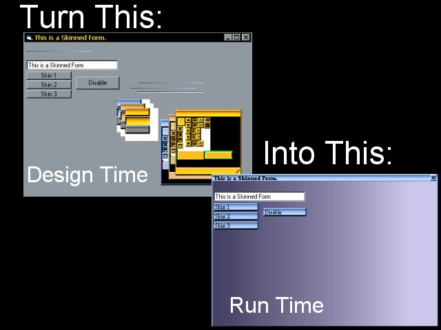



## More Window Skinning

### Description

Yet Another Skinning Example Make just for fun

to show what cool things you can do with BitBlt
 
### More Info
 

             |
---                |---
**Submitted On**   |2000-04-29 03:24:38
**By**             |[Michael Pote](https://github.com/Planet-Source-Code/PSCIndex/blob/master/ByAuthor/michael-pote.md)
**Level**          |Intermediate
**User Rating**    |4.7 (14 globes from 3 users)
**Compatibility**  |VB 4\.0 \(32\-bit\), VB 5\.0, VB 6\.0
**Category**       |[Custom Controls/ Forms/  Menus](https://github.com/Planet-Source-Code/PSCIndex/blob/master/ByCategory/custom-controls-forms-menus__1-4.md)
**World**          |[Visual Basic](https://github.com/Planet-Source-Code/PSCIndex/blob/master/ByWorld/visual-basic.md)
**Archive File**   |[CODE\_UPLOAD53224292000\.zip](https://github.com/Planet-Source-Code/michael-pote-more-window-skinning__1-7678/archive/master.zip)

